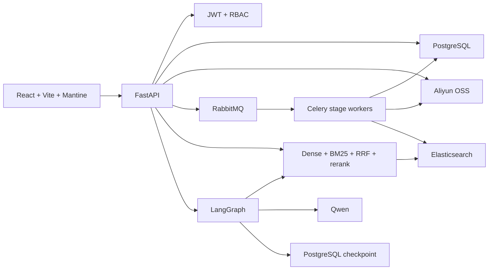

# 系统架构总览

## 定位

AI Knowledge Hub 是面向企业制度、运营资料和内部知识的 RAG 平台演示项目。它展示的重点是从原始文件到可引用回答的完整工程链路，而不是单独的聊天页面。

## 主链路



## 数据职责

| 组件 | 事实来源 |
| --- | --- |
| OSS | 原始文件和 multipart upload 状态对应的对象 |
| PostgreSQL | 用户、组织、知识库、文档、knowledge item、chunk、会话、任务和审计记录 |
| Elasticsearch | 可检索的 chunk、embedding、BM25 字段和组织/知识库过滤字段 |
| RabbitMQ/Celery | 阶段任务的投递和消费，不作为业务事实来源 |
| LangGraph checkpoint | interrupt/resume 的工作流状态，不替代 Message 业务记录 |

## 上传后的阶段

```text
OSS complete
  -> download
  -> validate
  -> parse
  -> split
  -> embed
  -> index
  -> documents.status = indexed
```

每个阶段在 PostgreSQL 中保留 job 状态，失败可以重试；同一文件的阶段仍然按依赖顺序执行，不同文件可以处于不同阶段形成流水线。

## 检索与回答

```text
问题
  -> Dense candidate + BM25 candidate
  -> RRF 去重融合
  -> BGE reranker 精排
  -> relevance gate
  -> LangGraph answer 或 human review
  -> answer + citations
```

权限过滤在 PostgreSQL 资源查询和 Elasticsearch 检索内部都执行，前端隐藏按钮不构成安全边界。

## 明确边界

当前项目是可复现的企业实习项目，不宣称已经具备 Kubernetes、多地域容灾、企业 SSO、计费和高可用集群能力。阿里云 OSS、Qwen 和本地 Elasticsearch 的真实验收需要外部依赖和凭据；CI 使用 fake/mock，避免把个人凭据变成测试前置条件。
