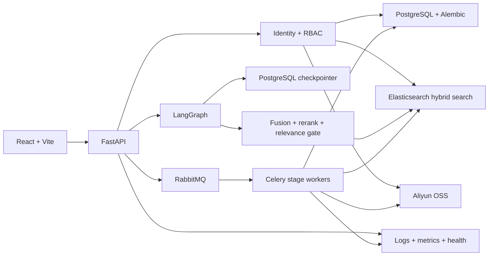
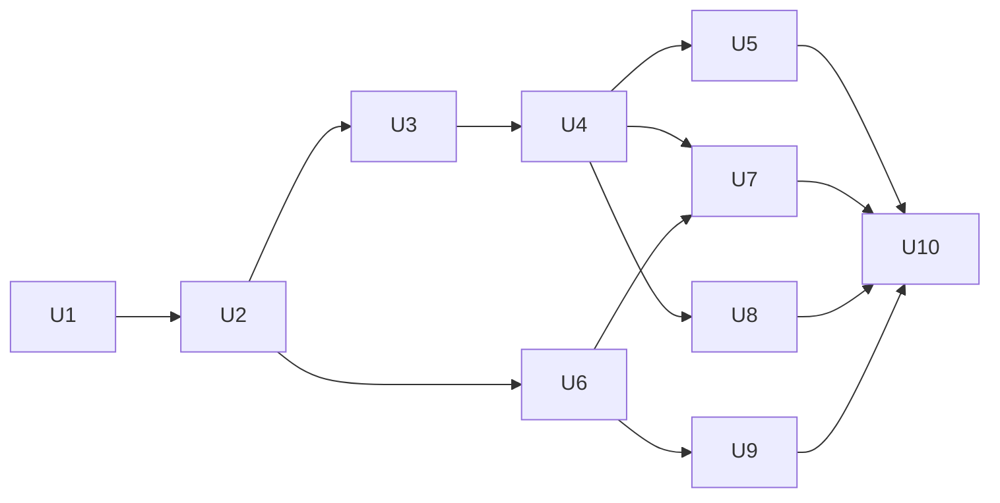

# Internship Enterprise Readiness - Plan

## Goal Capsule

### Objective

把当前约 65% 的“实习企业项目成熟度”提升到 80% 至 82%，使项目不仅具备完整功能，还能展示企业项目重视的数据演进、权限边界、可靠交付、可观测性和质量门禁。

### Authority hierarchy

执行时按以下优先级处理冲突：

1. 本计划的范围边界、要求和验收标准。
2. 仓库当前已经跑通的业务行为和回归测试。
3. `docs/improvements/` 下已有的专项升级设计。
4. 当前代码风格和目录结构。

### Execution profile

- 按 U1 至 U10 的依赖顺序实施，不把全部改动塞进一个分支。
- 每个单元独立开发、测试、提交，验收通过后再进入下一个单元。
- 先修基础设施和安全边界，再优化检索效果和前端体验。
- 数据结构改动必须通过 Alembic，不再增加运行时 `ALTER TABLE`。
- 改造过程中必须保留现有知识库 CRUD、文档索引、语义搜索、SSE 对话、人工审核和大文件上传能力。

### Stop conditions

出现以下情况时暂停当前单元，不自行扩大范围：

- 现有 PostgreSQL 数据无法通过备份、迁移或回滚方案安全保留。
- 权限模型需要从“单组织、租户就绪”升级为完整 SaaS 多租户。
- 外部服务版本不兼容，必须更换 PostgreSQL、Elasticsearch、RabbitMQ、OSS 或 LangGraph。
- 单元验收需要 Kubernetes、云上高可用集群或付费监控平台才能完成。

## Product Contract

### Summary

当前项目已经具备企业知识库的主要业务闭环：

```text
文档上传
  -> OSS Multipart Upload
  -> RabbitMQ / Celery 阶段任务
  -> 解析 / 切分 / Embedding / Elasticsearch
  -> 语义检索
  -> LangGraph RAG
  -> Human-in-the-loop
  -> React 管理与问答界面
```

下一阶段不以增加更多业务页面为重点，而是把这条链路改造成“可迁移、可授权、可部署、可诊断、可验证”的工程系统。

### Problem Frame

当前项目作为个人学习项目已经比较完整，但作为实习期间参与的企业项目仍存在以下明显信号：

- 数据表依赖 `SQLModel.metadata.create_all()` 和运行时 `ALTER TABLE` 演进。
- API 没有用户身份、角色和资源权限校验。
- Elasticsearch、OSS 和对话接口没有统一执行权限边界。
- LangGraph 使用 `InMemorySaver`，应用重启后 checkpoint 丢失。
- 服务缺少统一 Docker Compose、容器镜像和 CI 质量门禁。
- 健康检查只证明 FastAPI 进程存活，不能证明依赖服务可用。
- 日志、请求 ID、任务 ID和指标没有形成统一诊断链路。
- 检索仍以向量召回为主，缺少混合召回、重排和量化评估。
- 前端缺少自动化测试，核心聊天页面体积和复杂度较高。
- README 仍以 Day 1、Day 2 的学习过程为主，不像面向团队交付的项目入口。

### Requirements

#### Baseline and data evolution

- R1. 所有现有后端测试必须先恢复为稳定绿色，PDF splitter 基线差异必须确认是缺陷还是有意行为，不能直接覆盖快照掩盖回归。
- R2. PostgreSQL 业务表结构必须由 Alembic 管理，新环境可从空数据库升级到当前版本，已有开发数据库可安全 stamp 后继续迁移；第三方 checkpointer 自有表只能通过显式一次性 setup 初始化。
- R3. FastAPI 启动流程不得继续执行生产表结构变更。

#### Identity and authorization

- R4. 系统必须具备用户身份、登录、当前用户查询和安全密码存储能力。
- R5. 第一版采用单组织运行方式，但模型中保留 `organization_id` 和成员关系，避免未来多租户改造重写主表。
- R6. 至少支持 `owner / admin / editor / viewer` 四种角色，并明确知识库读取、编辑、删除、上传、索引、搜索和审核权限。
- R7. PostgreSQL 查询、Elasticsearch 检索、OSS 上传任务和 LangGraph 会话必须执行同一资源权限边界。
- R8. 未认证、越权访问和跨组织资源 ID 猜测必须返回一致的 `401 / 403 / 404` 行为，不能泄露资源是否存在。

#### Workflow durability

- R9. LangGraph checkpoint 必须持久化到 PostgreSQL，应用重启后可按 `thread_id` 恢复 interrupt 状态。
- R10. checkpoint、conversation、message 和 review task 必须验证用户与组织归属。

#### Delivery and operations

- R11. 项目必须提供后端、前端和 Celery Worker 的容器镜像，以及一条命令启动本地依赖和应用的 Compose 配置。
- R12. CI 必须自动执行后端测试、前端 lint、前端测试和生产构建。
- R13. 服务必须提供 liveness 和 readiness 检查，readiness 至少检查 PostgreSQL，并对 Elasticsearch、RabbitMQ 的必要性作明确区分。
- R14. HTTP 请求、Celery 任务和上传流水线必须携带可关联的 request ID、trace ID、upload ID、job ID 和 celery task ID。
- R15. 关键链路必须有结构化日志、基础指标和失败任务处理手册。

#### Retrieval quality

- R16. 检索必须支持 Elasticsearch BM25 与 dense vector 双路召回，并进行去重融合。
- R17. 候选 chunk 必须经过可配置的 rerank，最终 answer 只能使用通过 relevance gate 的证据。
- R18. metadata filter 和 permission filter 必须在召回阶段执行，不能只在返回结果后过滤。
- R19. 项目必须有固定问答评估集，并计算 Recall@K、MRR、无答案拒答率和引用正确率等指标。

#### Frontend quality and project presentation

- R20. 前端必须覆盖登录、知识库操作、上传索引、搜索、SSE 问答和 interrupt/resume 的关键自动化测试。
- R21. 前端必须具备全局鉴权处理、错误边界、加载、空状态和重试体验。
- R22. 大页面必须按路由或功能拆包，生产构建不得持续保留未经说明的大包告警。
- R23. README 必须以产品目标、架构、快速启动、测试、演示链路和设计取舍为主体，学习过程移到 docs 索引中。

### Acceptance Examples

- AE1. 新开发者从空数据库执行迁移和 Compose 启动后，可以登录、创建知识库、上传文件、等待索引并完成一次带引用回答。
- AE2. `viewer` 可以搜索和问答，但不能创建知识条目、删除知识库或批准人工审核。
- AE3. 用户手工修改另一个组织的 `knowledge_base_id` 后，数据库 API、搜索 API、OSS 上传 API 和聊天 API 都无法读取该资源。
- AE4. 对话在 `human_review` interrupt 处暂停，重启 FastAPI 后仍可通过同一 `thread_id` 审核并继续生成答案。
- AE5. PostgreSQL 不可用时 liveness 仍表示进程存活，readiness 返回失败并指出依赖异常。
- AE6. 一个上传失败可以通过 `upload_id -> job_id -> celery_task_id -> trace_id` 在日志中串起完整路径。
- AE7. 固定检索评估集运行后，混合检索加 rerank 的核心指标不低于改造前 baseline，并能减少无关文档高排位。
- AE8. CI 在数据库迁移、后端测试、前端测试、lint 或 build 任一失败时阻止合并。

### Success Criteria

“达到 80%”是本路线图用于控制范围的内部刻度，不是可以对外声称的行业认证。面试和项目展示只使用下面这些可检查的工程证据：

| Enterprise signal | Current evidence                   | Gap               | Required proof                         |
| ----------------- | ---------------------------------- | ----------------- | -------------------------------------- |
| 完整业务闭环      | 上传、索引、检索、RAG、HITL 已跑通 | 缺少统一 E2E      | 干净环境 happy path                    |
| 可控数据演进      | PostgreSQL + SQLModel              | 运行时补列        | Alembic 空库、存量库和回滚验证         |
| 安全知识边界      | ES 已有部分 metadata 字段          | 无身份和授权      | RBAC 与 SQL/ES/OSS/Chat 越权测试       |
| 可恢复工作流      | conversation/message 已持久化      | checkpoint 在内存 | interrupt/restart/resume               |
| 可重复交付        | 有独立依赖 compose                 | 无统一镜像和 CI   | 根 Compose、镜像、CI 门禁              |
| 可诊断运行        | 上传任务有状态和重试               | 缺少统一关联日志  | request/task/job 关联和 health/metrics |
| 可量化 RAG        | splitter 有回归快照                | 检索质量靠观察    | hybrid/rerank 离线评估报告             |
| 可维护前端        | 核心页面已经可用                   | 无自动化测试      | 关键 unit/E2E、鉴权和错误状态          |
| 可快速评审        | 有大量学习文档                     | 顶层表达分散      | README、架构图、演示脚本和证据页       |

全部 U1 至 U10 完成、Verification Contract 全部通过，并满足 Definition of Done 后，内部可认为达到了本计划定义的 80% 至 82%“实习企业项目标准”。对外应表述为“完成企业化工程闭环并提供验证证据”，不能表述为“达到真实生产系统 80%”。

即使代码已经完成，出现以下任一情况也不能判定达标：

- 新开发者不能在 30 分钟内根据 README 启动或理解演示环境。
- 无法在 2 分钟内解释可信回答、安全边界和可重复交付三条主线。
- 检索评估只展示成功案例，没有 baseline、失败问题和无答案问题。
- demo seed 无法稳定生成带正确引用的回答。
- 权限能力只有代码说明，没有可执行的越权测试证据。

### Scope Boundaries

#### Included

- 单组织用户体系和租户就绪的数据模型。
- API、PostgreSQL、Elasticsearch、OSS、Chat 的统一权限控制。
- Alembic 数据库迁移。
- PostgreSQL LangGraph checkpoint。
- 本地和 CI 可重复的容器化环境。
- 结构化日志、关联 ID、基础 metrics、健康检查和故障手册。
- BM25 + dense vector + fusion + rerank + relevance gate。
- 后端、前端、E2E 自动化测试。

#### Explicitly deferred

- 完整 SaaS 多租户管理、租户计费和套餐。
- 企业 SSO、OAuth2/OIDC、LDAP 和细粒度 ABAC。
- Kubernetes、跨地域容灾、RabbitMQ 集群、Elasticsearch 集群。
- Kafka、Service Mesh 和完整微服务拆分。
- 完整 OpenTelemetry Collector、云监控和 PagerDuty 告警平台。
- 复杂多 Agent 规划、自动选知识库和长期 Agent memory。
- 全量防病毒沙箱和企业 DLP 平台。

## Planning Contract

### Key Technical Decisions

- KTD1. 业务数据库演进采用 Alembic，替代运行时补列函数；第三方 checkpointer 表通过显式 setup 管理。（session-settled: user-approved — chosen over continuing `create_all + ALTER TABLE`: 企业项目需要可追踪、可回滚的 schema 历史）
- KTD2. 身份模型采用“单组织运行、租户就绪表结构”。（session-settled: user-approved — chosen over full SaaS multi-tenancy: 达到实习企业项目标准即可，避免扩展到租户计费和运营平台）
- KTD3. 权限判断以 PostgreSQL 主数据为事实来源，Elasticsearch 中冗余检索所需的组织和可见性字段。
- KTD4. LangGraph checkpoint 使用 PostgreSQL 持久化，与现有 conversation/message 业务记录继续分层保存。
- KTD5. 部署目标是开发和 CI 的生产近似 Compose 环境。（session-settled: user-approved — chosen over Kubernetes deployment: 当前重点是可重复交付和工程闭环，不是集群运维）
- KTD6. 检索升级为 hybrid retrieve -> fusion -> rerank -> relevance gate。（session-settled: user-approved — chosen over adding more Agent nodes: 当前质量瓶颈在证据召回和排序）
- KTD7. 外部服务仍保持现有 PostgreSQL、Elasticsearch、RabbitMQ、阿里云 OSS 和 Qwen，不在本轮替换技术栈。
- KTD8. CI 测试使用独立测试数据库和隔离索引，禁止连接开发或演示数据。
- KTD9. 80% 阶段优先建设工程证据，不引入对当前规模没有收益的微服务拆分。

### High-Level Technical Design



### Authorization model

角色的最小权限矩阵：

| 行为                   | owner | admin | editor | viewer |
| ---------------------- | ----- | ----- | ------ | ------ |
| 查看知识库、文档、条目 | 是    | 是    | 是     | 是     |
| 搜索和问答             | 是    | 是    | 是     | 是     |
| 创建和编辑内容         | 是    | 是    | 是     | 否     |
| 上传和构建索引         | 是    | 是    | 是     | 否     |
| 人工审核通过或拒绝     | 是    | 是    | 否     | 否     |
| 删除知识库             | 是    | 是    | 否     | 否     |
| 管理组织成员           | 是    | 否    | 否     | 否     |

实现时由集中式 dependency/policy 函数解释矩阵，API 不得散落角色字符串判断。

“管理组织成员”在本轮只表示数据模型、seed 脚本和 policy 支持，不包含邀请、成员管理页面、角色编辑 API、owner 转移、组织创建和账号生命周期。这些能力继续放在 Scope Boundaries 的 deferred 范围。

### Sequencing

```text
Phase 0 可信基线
  U1 测试与项目入口

Phase 1 数据基础
  U2 Alembic

Phase 2 安全边界
  U3 身份与角色
  U4 全链路资源授权

Phase 3 状态和交付
  U5 LangGraph 持久化
  U6 容器化与 CI
  U7 可观测性和运维

Phase 4 RAG 与前端质量
  U8 混合检索和评估
  U9 前端测试与性能

Phase 5 最终企业化验收
  U10 E2E、README 和演示证据
```

依赖关系：



### Implementation constraints

- 不删除或重写已经通过的 splitter、多格式 parser、OSS multipart 和 Celery 阶段任务。
- 迁移已有数据时先备份，再 stamp 基线，最后执行增量 migration。
- 密钥只能来自环境变量或 CI secret，测试中使用 fake provider 或 mock。
- 权限过滤必须在查询和召回阶段完成，不得先取出无权数据再由前端隐藏。
- 测试不得依赖个人阿里云 OSS、真实 Qwen key 或长期运行的共享 Elasticsearch 索引。
- 不用更新快照来代替解释 splitter 行为变化。
- `frontend/app/**/page.tsx` 是当前 Vite 项目沿用的页面目录约定，不代表重新引入 Next.js。
- `docs/operations/enterprise-readiness-evidence.md` 从 U1 建立骨架，后续每个单元持续补证据，不等 U10 才开始整理演示材料。

## Implementation Units

### Unit Index

| U-ID | Title                       | Primary files                                                    | Depends on     |
| ---- | --------------------------- | ---------------------------------------------------------------- | -------------- |
| U1   | 建立可信测试基线            | `backend/tests/`, `README.md`                                | 无             |
| U2   | 引入 Alembic                | `backend/alembic/`, `backend/app/db/database.py`             | U1             |
| U3   | 用户、组织与角色            | `backend/app/api/auth.py`, `backend/app/security/`           | U2             |
| U4   | 全链路资源授权              | `backend/app/api/`, `backend/app/services/vector_service.py` | U3             |
| U5   | 持久化 LangGraph checkpoint | `backend/app/graph/langgraph_workflow.py`                      | U4             |
| U6   | 容器化和 CI                 | `compose.yml`, `.github/workflows/ci.yml`                    | U2             |
| U7   | 可观测性和运维闭环          | `backend/app/observability/`, `docs/operations/`             | U4, U6         |
| U8   | 混合检索、rerank 和评估     | `backend/app/services/retrieval/`                              | U4             |
| U9   | 前端测试、鉴权和性能        | `frontend/src/`, `frontend/tests/`                           | U3, U6         |
| U10  | 企业化 E2E 和交付文档       | `backend/tests/e2e/`, `README.md`                            | U5, U7, U8, U9 |

### U1. 建立可信测试基线

**Goal:** 在结构性改造开始前固定当前正确行为，消除已知红灯和学习型项目入口。

**Requirements:** R1, R23

**Files:**

- `backend/tests/test_splitter_regression.py`
- `backend/tests/fixtures/splitter_regression/expected/pdf_policy.snapshot.json`
- `backend/tests/fixtures/splitter_regression/expected/pdf_policy.metrics.json`
- `backend/app/services/document_splitter/parsers/pdf_layout_parser.py`
- `README.md`
- `docs/README.md`
- `docs/operations/enterprise-readiness-evidence.md`

**Approach:**

- 重现 `pdf_policy` 的 snapshot 和 metrics 差异，判断是 parser 非确定性、依赖版本差异还是预期输出已改变。
- 若是缺陷，修 parser 并保留原 baseline；若是确认后的行为升级，记录差异原因后更新 baseline。
- 建立一份全量测试基线报告，记录后端、前端 lint/build、关键 E2E 的当前结果。
- 重写 README 顶层结构，把 Day 记录移到 docs 导航，保留学习资料但不让其成为项目主叙事。
- 建立企业化证据页骨架，按“可信回答、安全边界、可重复交付”组织后续截图、测试结果、指标和已知限制。

**Test Scenarios:**

1. 相同 PDF fixture 连续运行两次得到完全相同的 elements、sections、blocks、chunks 和 metrics。
2. TXT、Markdown、CSV、DOCX、XLSX 和 PDF 所有 splitter snapshot 通过。
3. 后端全量测试不再有已知失败。
4. README 快速启动步骤可以从干净终端执行，不引用已移除的 SQLite、Chroma 或 Next.js。

**Verification:**

- `cd backend && ./.venv/bin/python -m unittest discover -s tests -p "test_*.py"`
- `cd frontend && npm run lint`
- `cd frontend && npm run build`

### U2. 用 Alembic 管理 PostgreSQL schema

**Goal:** 建立可追踪、可升级、可回滚的数据结构演进机制。

**Requirements:** R2, R3

**Files:**

- `backend/requirements.txt`
- `backend/alembic.ini`
- `backend/alembic/env.py`
- `backend/alembic/versions/*_baseline.py`
- `backend/app/db/database.py`
- `backend/app/main.py`
- `backend/scripts/migrate_database.sh`
- `backend/tests/test_database_migrations.py`
- `docs/operations/database-migrations.md`

**Approach:**

- 生成与当前 SQLModel metadata 一致的 baseline migration，并人工核对约束、索引和默认值。
- 为已有开发库提供 backup -> `alembic stamp` -> `alembic upgrade` 操作说明。
- 删除 `ensure_*_columns()` 运行时 DDL；应用启动只验证连接和当前 revision，不偷偷改表。
- 测试库必须从空库通过 `upgrade head` 创建，不通过 `create_all` 绕过迁移。

**Test Scenarios:**

1. 空 PostgreSQL 数据库执行 `upgrade head` 后包含当前全部表、索引和外键。
2. 已有 schema stamp baseline 后可执行后续权限 migration，原有知识库和文档数据保留。
3. 最近一个增量 migration 可以 downgrade 再 upgrade，数据保留策略符合文档说明。
4. 数据库 revision 落后时应用启动或 readiness 给出明确错误，不自动补列。

**Verification:**

- `cd backend && ./.venv/bin/alembic upgrade head`
- `cd backend && ./.venv/bin/alembic current`
- `cd backend && ./.venv/bin/python -m unittest tests.test_database_migrations`

### U3. 建立用户、组织与 RBAC

**Goal:** 为所有业务请求建立可信身份和集中式角色策略。

**Requirements:** R4, R5, R6, R8

**Files:**

- `backend/app/db/models.py`
- `backend/alembic/versions/*_identity_and_permissions.py`
- `backend/app/schemas/auth.py`
- `backend/app/api/auth.py`
- `backend/app/security/passwords.py`
- `backend/app/security/tokens.py`
- `backend/app/security/dependencies.py`
- `backend/app/security/policies.py`
- `backend/app/main.py`
- `backend/app/config.py`
- `backend/tests/test_auth_api.py`
- `backend/tests/test_rbac_policies.py`
- `frontend/app/login/page.tsx`
- `frontend/lib/api/client.ts`
- `frontend/lib/api/types.ts`

**Approach:**

- 增加 `organizations`、`users`、`organization_memberships`，第一版创建一个默认组织。
- 密码只保存强哈希；登录返回短期 access token，`GET /api/auth/me` 返回用户和组织角色。
- 集中定义 role -> permission 映射，并通过 FastAPI dependencies 获取 current principal。
- 开发 seed 通过显式脚本创建管理员，生产启动不得自动创建默认密码。
- access token 使用短 TTL，包含并校验 `sub / exp / iss / aud / jti`；第一版保存在当前标签页的 `sessionStorage`，不使用长期 `localStorage`，logout 和 401 必须立即清除。
- 登录接口增加可配置的单进程限流和失败退避；多 API 副本下的分布式限流明确留到集群阶段。
- 前端增加登录状态和统一 `Authorization` header，收到 401 时清理会话并回登录页。
- identity migration 只创建身份相关表；存量业务资源的归属回填留在 U4，避免身份表和全链路授权在同一个 migration 中混杂。

**Test Scenarios:**

1. 正确账号可登录，错误密码返回统一错误且不泄露账号是否存在。
2. token 缺失、过期、签名错误分别返回 401。
3. 四种角色的权限矩阵逐项测试，viewer 无法执行写操作。
4. 密码、token secret 和 OSS/LLM key 不出现在日志和 API 响应中。
5. 连续错误密码触发限流或退避；JWT issuer、audience 或 jti 不合法时拒绝访问。
6. logout 后旧 token 从当前标签页移除，页面刷新不会恢复已退出会话。

**Verification:**

- `cd backend && ./.venv/bin/python -m unittest tests.test_auth_api tests.test_rbac_policies`
- `cd frontend && npm run build`

### U4. 将授权边界贯穿 PostgreSQL、Elasticsearch、OSS 和 Chat

**Goal:** 防止仅靠前端隐藏或单个 API 校验形成的越权漏洞。

**Requirements:** R7, R8, R10, R18

**Files:**

- `backend/app/api/knowledge_base.py`
- `backend/app/api/knowledge_item.py`
- `backend/app/api/document.py`
- `backend/app/api/search.py`
- `backend/app/api/chat.py`
- `backend/app/api/upload.py`
- `backend/app/services/vector_service.py`
- `backend/app/services/upload_service.py`
- `backend/app/services/storage/aliyun_oss.py`
- `backend/app/db/models.py`
- `backend/alembic/versions/*_resource_ownership_backfill.py`
- `backend/tests/test_resource_authorization.py`
- `backend/tests/test_search_permissions.py`
- `backend/tests/test_upload_permissions.py`
- `backend/tests/test_chat_permissions.py`

**Approach:**

- 为 knowledge base、document、knowledge item、conversation、upload task 增加组织和创建人归属。
- 所有按 ID 查询都先限定 organization，再判断角色，避免通过 ID 猜测跨组织资源。
- ES mapping 和索引文档增加 `organization_id`、`knowledge_base_id`、visibility 或 permission group。
- kNN 和 BM25 查询都在 Elasticsearch 内部执行 permission filter。
- OSS object key 保持后端生成，并加入组织/知识库边界；presign 前再次校验 upload task 所有权。
- presign 绑定 upload task 状态、part number、HTTP method、签名头和 object prefix；TTL 不超过配置上限，complete 后不得继续签发。
- 内容长度和 magic number 在服务端后处理阶段再次校验，不能把 presign 当作最终文件安全校验。
- 删除知识库继续采用保护性删除，依赖数据存在时返回明确冲突，不在本单元实现复杂异步级联清理。
- 资源归属 migration 按 add nullable columns -> 创建默认组织和管理员映射 -> 回填存量行 -> 添加索引和外键 -> 必要字段设为 non-null 的顺序执行。
- PostgreSQL 回填完成后创建带版本号的新 ES index，reindex 存量 chunk 并切换 alias；回滚时保留旧 index，避免数据库和检索权限字段不同步。

**Test Scenarios:**

1. A 组织用户无法读取、修改、搜索、上传到或对话访问 B 组织知识库。
2. viewer 可以下载授权内容和搜索，但不能获取上传 presign URL。
3. ES 中即使存在无权且分数更高的 chunk，也不会进入 top-k 或日志响应。
4. conversation 和 review resume 只能由会话所属用户或具备审核权限的成员操作。
5. 删除包含 document/chunk/upload task 的知识库返回 409，并报告依赖类型。
6. 过期 URL、错误 HTTP method、错误 content type、越界 part size、已完成任务重放和跨 prefix object key 均被拒绝或在 complete/validate 阶段失败。

**Verification:**

- `cd backend && ./.venv/bin/python -m unittest tests.test_resource_authorization tests.test_search_permissions tests.test_upload_permissions tests.test_chat_permissions`

### U5. 持久化 LangGraph checkpoint

**Goal:** 让 interrupt/resume 在进程重启和多 Worker 环境下保持正确。

**Requirements:** R9, R10

**Files:**

- `backend/requirements.txt`
- `backend/app/graph/checkpointer.py`
- `backend/app/graph/langgraph_workflow.py`
- `backend/app/api/chat.py`
- `backend/app/config.py`
- `backend/tests/test_graph_checkpoint_persistence.py`
- `backend/tests/test_chat_api.py`
- `docs/operations/chat-checkpoint-recovery.md`

**Approach:**

- 使用官方 `langgraph-checkpoint-postgres`，先用依赖解析和最小 spike 确认与 `langgraph==0.6.11` 兼容后锁定版本，同时启用项目现有 Psycopg 3 driver 和 pool extra。
- 采用同步 `PostgresSaver` 以匹配当前同步 graph/API 调用；若 spike 证明同步 saver 会阻塞 SSE，再把异步迁移作为单独决策，不在本单元混用两套 API。
- checkpointer 生命周期由 FastAPI lifespan 管理，连接配置独立于业务 Session。
- checkpointer 自有表通过显式一次性 `setup` 命令初始化，不允许每个 API/Worker startup 自动执行；这是第三方工具表对 Alembic 业务表规则的唯一例外。
- `thread_id` 必须和 conversation、organization、owner 绑定；resume 前同时校验业务记录与 checkpoint。
- 明确 checkpoint 是工作流执行状态，message 是用户可见业务记录，两者不能互相替代。

**Test Scenarios:**

1. 图在 human review interrupt 后停止，销毁 graph 实例再构建仍可读取 snapshot。
2. 模拟应用重启后使用原 thread_id resume，最终 answer 和 message 只写一次。
3. 重复 resume、错误 thread_id 和其他用户 thread_id 分别被幂等或拒绝。
4. checkpoint 写入失败时不把 review task 错误标为已完成。

**Verification:**

- `cd backend && ./.venv/bin/python -m unittest tests.test_graph_checkpoint_persistence tests.test_chat_api`

### U6. 建立统一容器化环境和 CI

**Goal:** 让项目在新机器和 CI 中具有可重复的构建与验证过程。

**Requirements:** R11, R12

**Files:**

- `backend/Dockerfile`
- `frontend/Dockerfile`
- `frontend/nginx.conf`
- `compose.yml`
- `compose.override.yml`
- `.dockerignore`
- `.github/workflows/ci.yml`
- `backend/scripts/wait_for_dependencies.py`
- `backend/scripts/start_api.sh`
- `backend/scripts/start_worker.sh`
- `docs/operations/local-stack.md`

**Approach:**

- Compose 统一 PostgreSQL、Elasticsearch、RabbitMQ、backend、Celery Worker 和 frontend。
- 阿里云 OSS 和 Qwen 保持外部依赖；本地自动化测试通过 fake/mock 避免强制真实密钥。
- backend 容器启动顺序为 dependency wait -> Alembic upgrade -> Uvicorn。
- Worker 不负责运行 migration，避免多个副本并发升级数据库。
- CI 分为 backend、frontend、migration 和 integration jobs，使用缓存但不缓存敏感信息。

**Test Scenarios:**

1. 新环境执行一条 Compose 命令后，全部本地服务进入 healthy。
2. backend 镜像中无 `.env`、上传原文件、测试数据库和开发缓存。
3. migration 失败时 backend 不启动，Worker 不消费任务。
4. CI 对后端测试、迁移测试、前端 lint/test/build 任一失败均返回失败。

**Verification:**

- `docker compose config`
- `docker compose build`
- `docker compose up -d`
- `docker compose ps`

### U7. 补齐可观测性和运维闭环

**Goal:** 让 API、Celery 和上传流水线出现故障时可以定位，而不是只看到 500 或 pending。

**Requirements:** R13, R14, R15

**Files:**

- `backend/app/observability/logging.py`
- `backend/app/observability/context.py`
- `backend/app/observability/metrics.py`
- `backend/app/middleware/request_context.py`
- `backend/app/api/health.py`
- `backend/app/celery_app.py`
- `backend/app/tasks/upload_tasks.py`
- `backend/app/services/upload_postprocess_service.py`
- `backend/tests/test_health_api.py`
- `backend/tests/test_observability.py`
- `docs/operations/incident-runbook.md`
- `docs/operations/dead-letter-and-retry.md`

**Approach:**

- 输出结构化 JSON 日志，统一字段名和敏感字段脱敏。
- HTTP 入口生成或接受 request ID；投递 Celery 时传入 trace ID，并在后续 stage job 中继续传播。
- 拆分 `/health/live` 和 `/health/ready`；ready 检查 PostgreSQL，并按接口职责检查 ES/RabbitMQ。
- 暴露低基数 metrics：请求耗时、错误数、检索耗时、LLM 调用状态、job stage 状态、重试和死信数。
- 提供失败 job、DLQ 和卡住 lease 的只读诊断命令及书面恢复步骤，不在本轮制作可写运维控制台或自动恢复平台。

**Stop line:** 本单元必须完成关联 ID、JSON 日志、敏感信息脱敏、live/ready、低基数 metrics 和恢复 runbook。带权限的 DLQ 重放工具、自动 lease 修复、告警平台、dashboard 和完整 OpenTelemetry Collector 留到后续。

**Test Scenarios:**

1. 任意 API 响应包含 request ID，日志中可以按该 ID 找到开始、结束和异常。
2. 上传 complete 后，HTTP trace ID 能传播到每个阶段 job 和 Celery task。
3. PostgreSQL 断开时 live 成功、ready 失败；恢复后 ready 自动恢复。
4. Elasticsearch 不可用时搜索相关 readiness 显示 degraded；RabbitMQ 不可用时上传处理 readiness 显示 degraded，但不把纯只读 PostgreSQL API 误判为不可用。
5. 业务重试耗尽后消息进入 DLQ，只读诊断命令和 runbook 能定位消息及对应数据库 job。
6. 日志不会输出密码、JWT、OSS secret、LLM key 或完整 presigned URL。

**Verification:**

- `cd backend && ./.venv/bin/python -m unittest tests.test_health_api tests.test_observability tests.test_celery_configuration`
- 使用一次成功上传和一次强制失败上传核对关联日志与 metrics。

### U8. 升级混合检索、rerank 和评估

**Goal:** 从“能向量搜索”升级为结果可解释、效果可量化的企业 RAG 检索链路。

**Requirements:** R16, R17, R18, R19

**Files:**

- `backend/app/services/retrieval_service.py`
- `backend/app/services/retrieval/reranker.py`
- `backend/app/services/retrieval_evaluation.py`
- `backend/app/services/vector_service.py`
- `backend/app/services/rag_service.py`
- `backend/app/graph/nodes.py`
- `backend/app/config.py`
- `backend/tests/test_hybrid_retrieval.py`
- `backend/tests/test_reranker.py`
- `backend/tests/test_retrieval_evaluation.py`
- `backend/tests/fixtures/retrieval_evaluation/cases.json`
- `docs/improvements/retrieval-quality-improvements.md`

**Approach:**

- 在现有 vector service 之上分别获取 dense top-k 和 BM25 top-k，再通过 RRF 等确定性策略融合并按 chunk 去重，不先搭建通用 retriever framework。
- reranker 只保留一个薄接口，可配置为本地 BGE reranker；测试使用确定性 fake。
- relevance gate 使用 rerank score、证据覆盖和业务实体命中综合判断，替换单一向量阈值。
- permission 和 metadata filter 在两个 retriever 中保持一致。
- 固定事实型、条件型、流程型、总结型、无答案和越权问题，保存 baseline 和升级后报告。
- query rewrite 只有在离线评估证明提升后再开启，默认不作为 U8 的阻塞项。

**Stop line:** U8 交付 BM25 + dense + RRF、权限过滤、一个 reranker adapter、relevance gate 和固定评估报告。多 reranker provider、复杂 plugin registry、在线 A/B、query rewrite 和自动调参不属于本轮。

**Test Scenarios:**

1. 精确业务术语问题由 BM25 补强，语义改写问题由 dense retriever 补强。
2. 两路命中同一 chunk 时只保留一个候选，保留来源和原始分数。
3. rerank 后真正回答问题的 chunk 排在背景段之前。
4. 无答案问题进入 no-answer 或 human review，不基于弱相关内容硬答。
5. 无权 chunk 在 fusion 前已经被过滤。
6. 新版本 Recall@5、MRR 和引用正确率不得低于 baseline；无答案拒答率需达到评估集定义阈值。

**Verification:**

- `cd backend && ./.venv/bin/python -m unittest tests.test_hybrid_retrieval tests.test_reranker tests.test_retrieval_evaluation`
- 生成并保存一份可对比的 retrieval evaluation 报告。

### U9. 补齐前端鉴权、自动化测试和性能

**Goal:** 让关键用户流程可回归，并降低聊天工作台的维护和加载风险。

**Requirements:** R20, R21, R22

**Files:**

- `frontend/package.json`
- `frontend/vite.config.ts`
- `frontend/src/router.tsx`
- `frontend/src/auth/auth-provider.tsx`
- `frontend/src/auth/protected-route.tsx`
- `frontend/lib/api/client.ts`
- `frontend/app/chat/page.tsx`
- `frontend/app/chat/components/`
- `frontend/tests/unit/`
- `frontend/tests/e2e/`
- `frontend/playwright.config.ts`

**Approach:**

- 引入 Vitest、React Testing Library 和 Playwright。
- 在 `frontend/package.json` 增加非 watch 的 `test` 和 `test:e2e` 脚本；Playwright 默认按配置启动 Vite preview，完整 Compose E2E 由 U10 单独执行。
- 把 auth、SSE parser、conversation list、review panel 从聊天大页面中拆成可独立测试模块。
- 页面路由使用 lazy import；图标和重型组件按需加载。
- 统一 API error mapping、401 处理、toast、retry、loading、empty 和 error boundary。
- E2E 使用测试用户和隔离知识库，不连接个人演示数据。

关键交互状态必须显式覆盖：

| Surface        | Required states                                                                                                        |
| -------------- | ---------------------------------------------------------------------------------------------------------------------- |
| Auth           | checking session、login error、authenticated、expired、logged out、forbidden                                           |
| Knowledge CRUD | loading、empty、saving、conflict、retryable error、success                                                             |
| Upload/index   | selecting、uploading、processing、indexed、failed、retry                                                               |
| Search         | idle、loading、no evidence、results、degraded dependency                                                               |
| Chat/HITL      | sending、streaming、stream error、interrupted、approving/rejecting、resumed、completed、no-answer、unauthorized review |

**Stop line:** 必做 auth guard、统一 401/403、SSE parser 与 interrupt/resume unit tests，以及一条 Playwright happy path。组件只在可测试性需要时拆分；全面视觉重做和浏览器矩阵不属于本轮。已有构建告警仍需通过路由 lazy loading 解决。

**Test Scenarios:**

1. 登录成功进入受保护页面，token 过期后回到登录页。
2. viewer 界面不显示写操作，直接调用仍由后端拒绝。
3. 知识库 CRUD、文档上传索引、语义搜索完成一条浏览器流程。
4. SSE answer 增量按顺序展示，引用在完成后展示。
5. interrupted 消息在对话区域展示审核面板，通过和拒绝都能恢复正确状态。
6. 历史会话切换不会把上一会话的流式回答插入当前会话。
7. 生产构建主要路由拆包，聊天页不进入首屏主 bundle。
8. 登录、上传、聊天和审核可以只用键盘完成；状态消息通过合适的 `aria-live` 宣告，modal 关闭后焦点恢复。

**Verification:**

- `cd frontend && npm run lint`
- `cd frontend && npm run test`
- `cd frontend && npm run build`
- `cd frontend && npm run test:e2e`

### U10. 建立最终 E2E、运行手册和项目证据

**Goal:** 用一套可复现证据证明项目达到本计划定义的 80% 标准。

**Requirements:** R1-R23

**Files:**

- `backend/tests/e2e/test_enterprise_happy_path.py`
- `backend/tests/e2e/test_authorization_boundaries.py`
- `backend/tests/e2e/test_restart_recovery.py`
- `backend/scripts/seed_demo_environment.py`
- `README.md`
- `docs/architecture/system-overview.md`
- `docs/operations/demo-and-acceptance.md`
- `docs/operations/backup-and-recovery.md`
- `docs/operations/enterprise-readiness-evidence.md`
- `docs/improvements/README.md`
- `docs/improvements/multiformat-e2e-test-dataset-requirements.md`
- `backend/tests/fixtures/multiformat_e2e/source/*`
- `backend/tests/fixtures/multiformat_e2e/manifest.json`
- `backend/tests/fixtures/multiformat_e2e/queries.json`
- `backend/tests/fixtures/multiformat_e2e/expected/*`

**Approach:**

- 提供不包含真实 secret 的 demo seed，生成组织、四种角色、知识库和可检索样本。
- 自动化 happy path 覆盖 login -> 上传 TXT/MD/PDF/DOCX/XLSX -> OSS -> documents -> stages -> indexed -> search -> chat -> citations。
- 多格式测试集必须按照 `multiformat-e2e-test-dataset-requirements.md` 生成，并使用 manifest 固定解析、切片和检索预期。
- E2E 必须同时验证文件格式识别、Section/Block 结构、chunk metadata、PostgreSQL chunks、Elasticsearch vector_id 和最终引用。
- 自动化 security path 覆盖 401、403、跨组织 ID、ES 权限过滤和 OSS presign 越权。
- 自动化 restart path 覆盖 interrupt -> restart -> resume。
- README 用架构图、快速启动、核心流程、技术取舍、测试方式和已知边界表达项目。
- 把学习型 Day 文档、MQ 学习文档和专项改造文档保留在 docs 导航。
- 完成证据页，集中展示架构、关键测试输出、权限负向案例、检索前后指标、失败恢复过程、演示截图和明确的非目标。

**Test Scenarios:**

1. 干净 Compose 环境在规定步骤内完成 demo seed 和完整业务闭环。
2. 四种角色的验收矩阵全部符合预期。
3. TXT、Markdown、PDF、DOCX、XLSX 五种文件都能完成上传、解析、切片、索引和检索；每种格式的 manifest 预期通过。
4. Worker 重启、FastAPI 重启和一次可恢复的外部服务失败不会造成重复 document/chunk/message。
5. 无答案问题进入 no-answer 或 human review，跨组织问题不返回受限证据。
6. 全部测试和构建在 CI 通过。
7. 新开发者只阅读 README 和 operations docs 即可运行、测试、定位失败任务。

**Verification:**

- 执行 Verification Contract 中全部命令。
- 按 `docs/operations/demo-and-acceptance.md` 完成一次人工演示。
- 将最终成熟度矩阵、检索评估报告和已知非目标写入验收记录。

## System-Wide Impact

### Data lifecycle

- Alembic 成为唯一 schema 变更入口。
- 用户和组织归属会进入主要业务表，需要一次明确的数据回填 migration。
- ES 旧索引缺少组织字段，必须通过版本化新索引和 reindex 迁移，不能原地假设字段存在。
- LangGraph checkpoint 会新增持久数据，需要定义保留期限和 conversation 删除策略。

### Security boundary

- API 从默认公开变成默认需要身份。
- Swagger 开发体验需要增加 Bearer token 授权，不应通过关闭鉴权解决测试便利性。
- OSS presign URL 是短期授权凭据，日志和审计中只能记录 object key 摘要与过期时间。
- 前端隐藏按钮仅改善体验，真正的授权以服务端为准。

### Performance

- hybrid retrieval 和 rerank 会增加一次检索延迟，需要记录各阶段耗时。
- 权限字段必须使用 keyword mapping 和合适索引，避免过滤导致全量扫描。
- PostgreSQL checkpointer 应使用独立连接池配置，避免挤占业务 Session。
- 前端路由拆包减少首屏资源，但聊天页面进入时会发生独立加载。

### Operations

- API、Worker 和 migration 的启动职责必须分离。
- PostgreSQL、RabbitMQ、Elasticsearch 故障表现必须在 readiness、日志和 runbook 中一致。
- 失败任务既有 PostgreSQL job 状态也有 RabbitMQ DLQ，必须定义各自职责，避免两套系统重复重试。

## Risks & Dependencies

- Alembic baseline 与现有开发数据库可能漂移。实施前必须备份并比较 metadata、真实 schema 和 baseline。
- 全链路权限改造涉及所有 API 和 ES 索引，是本计划风险最高的部分，应单独分支并优先补负向测试。
- LangGraph PostgreSQL checkpointer 的包版本必须和当前 `langgraph==0.6.11` 兼容，实施时先做最小持久化 spike。
- BGE reranker 可能增加本机内存和响应耗时，应保留配置开关和 fake test provider。
- 阿里云 OSS 无法作为 CI 强依赖，必须保持 storage abstraction 可注入。
- 前端聊天页目前较大，拆组件时必须先固定 SSE、conversation 和 interrupt 行为测试。

## Verification Contract

### Required automated gates

```bash
cd backend
./.venv/bin/alembic upgrade head
./.venv/bin/python -m unittest discover -s tests -p "test_*.py"
```

```bash
cd frontend
npm ci
npm run lint
npm run test
npm run build
npm run test:e2e
```

```bash
docker compose config
docker compose build
docker compose up -d
docker compose ps
```

PR 必过门禁执行 migration、backend tests、frontend lint/test/build 和 fake-provider integration smoke。完整 Compose、真实 RabbitMQ 阶段流水线、隔离 Elasticsearch E2E 和 Playwright 全链路可以放在 nightly、手动 acceptance 或发布分支，避免每个小提交都拉起全部重型依赖。

### Required integration gates

- 从空 PostgreSQL database 执行 migration。
- 对一份存量开发库备份副本执行 schema 对比、baseline stamp、upgrade head 和回滚演练。
- 使用隔离 ES index 运行 document indexing 和 hybrid search。
- 使用 RabbitMQ 测试 queue 运行至少一条完整阶段流水线。
- 使用 fake OSS 完成 CI E2E；真实 OSS E2E 作为受控手工验收。
- 在 human review interrupt 后重启 API，再完成 resume。
- 使用两个组织验证 SQL、ES、OSS 和 Chat 的跨组织隔离。

### Required quality gates

- 后端测试零失败、零 error。
- 前端 lint、unit、E2E 和 production build 全部通过。
- migration 不依赖 `SQLModel.metadata.create_all()` 创建业务表。
- 所有受保护 API 都有至少一个未认证和一个越权测试。
- 检索评估报告包含 baseline 与 current 对比，不只展示成功案例。
- 日志扫描不包含 secret、JWT 和完整 presigned URL。
- Docker Compose 所有必要服务进入 healthy，README 命令与实际一致。

### Manual review gates

- owner、admin、editor、viewer 四角色界面和接口行为抽查。
- 上传失败、Celery retry、DLQ 和 ES 不可用的排障流程演练；LLM 429 本轮以自动化 fake 和 runbook 验证。
- 对 README 完成一次“新开发者 30 分钟启动”验证。
- 使用演示问题检查答案、引用、检索证据和人工审核 UI。

## Definition of Done

### Global

- R1 至 R23 均有实现和测试证据。
- U1 至 U10 按依赖顺序完成，每个单元的 Test Scenarios 均通过。
- 全部 Verification Contract 门禁通过。
- 项目不再在应用 startup 中执行生产 schema DDL。
- API、搜索、OSS 和 Chat 不存在已知跨组织越权路径。
- interrupt 状态可跨应用重启恢复。
- CI 能在干净环境重建数据库、运行测试和构建前后端。
- README、架构文档和运行手册与实际代码一致。
- U1 至 U10 触及的文件以及本路线新增依赖中，实验性实现、废弃兼容代码、无效脚本和未使用依赖已清理；不扩展为全仓历史债务清理。

### Per-unit completion

- U1：现有回归测试全绿，README 不再以 Day 列表作为主入口。
- U2：空库和已有库迁移路径均验证，运行时补列代码移除。
- U3：登录和四角色 RBAC 可用，token 与密码处理通过安全测试。
- U4：PostgreSQL、ES、OSS、Chat 的权限边界通过负向测试。
- U5：interrupt/restart/resume 测试通过，不重复写消息。
- U6：镜像、Compose 和 CI 在干净环境通过。
- U7：健康检查、关联日志、metrics 和失败任务 runbook 可验证。
- U8：混合检索和 rerank 指标达到评估集门槛，弱证据不硬答。
- U9：核心前端流程有 unit/E2E 覆盖，路由拆包后 build 无未解释告警。
- U10：企业 happy path、安全 path、重启恢复和人工演示全部通过。
