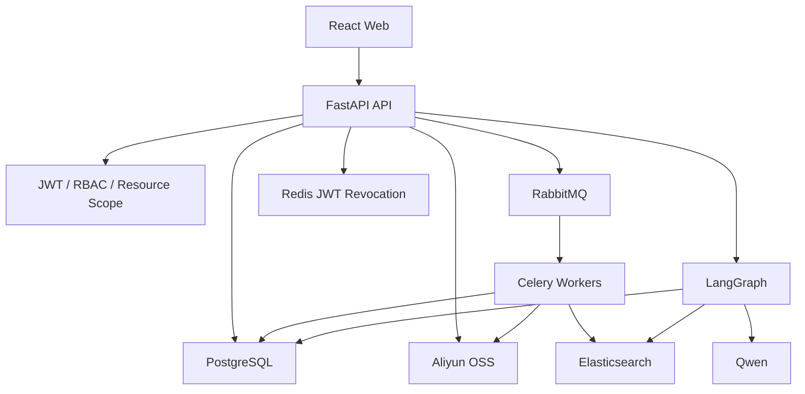

# 01 系统架构与项目讲述

## 一、先讲业务，不先讲框架

企业资料问答的主要问题不是“调用一次大模型”，而是：

- 文档格式和结构不同；
- 文件可能很大，上传和解析耗时；
- 精确术语和语义表达需要不同检索方式；
- 模型必须给出处，证据不足时不能硬答；
- 不同组织和角色不能互相看到数据；
- 任务失败后必须能定位、重试和恢复。

因此项目被拆成五个子系统：

```text
身份与资源管理
文档上传与异步处理
多格式解析与切分
混合检索与 RAG
Agent 工作流与人工审核
```

## 二、分层架构



### 数据职责

| 存储          | 主职责                                           | 为什么不互相替代                           |
| ------------- | ------------------------------------------------ | ------------------------------------------ |
| PostgreSQL    | 用户、组织、文档、chunk 元数据、消息、任务、审核 | 强事务、关系约束和业务主事实               |
| OSS           | 原始大文件                                       | 适合大对象、低成本、可直传，不适合关系查询 |
| Elasticsearch | BM25、向量检索、过滤                             | 为搜索优化，不作为业务主数据库             |
| Redis         | 短期 JWT 撤销记录                                | 高速、有 TTL，不承担长期业务数据           |
| RabbitMQ      | 异步任务传递                                     | 解耦生产者与消费者，不替代任务状态表       |

## 三、项目最值得讲的三个设计

### 1. 上传和处理解耦

上传完成不在 HTTP 请求中同步解析、Embedding 和索引。接口只确认对象完整并创建阶段任务，Worker 异步处理。这样避免请求超时，也能分别控制解析和 Embedding 并发。

### 2. 混合检索而不是单路向量搜索

Dense 擅长同义表达，BM25 擅长编号、错误码、制度名。两路通过 RRF 按名次融合，再由 BGE reranker 判断 query 和 chunk 的真实相关性。

### 3. checkpoint 与消息分开

`messages` 是用户可见的聊天记录；LangGraph checkpoint 是节点执行状态。前者用于产品历史，后者用于中断后恢复。二者不能互相替代。

## 四、为什么这不是简单 Demo

项目已经覆盖：

- 多格式真实解析与切分；
- OSS multipart 上传和自动索引；
- RabbitMQ + Celery 阶段任务；
- PostgreSQL schema migration；
- 组织归属、RBAC、JWT 撤销和审计；
- ES 权限过滤、Dense/BM25/RRF/rerank；
- LangGraph checkpoint、interrupt/resume；
- React 管理端和 SSE 问答；
- Compose、CI、健康检查、日志和 metrics；
- 多格式回归样本、检索评估和 E2E。

但不要说成已经达到大型生产平台标准。当前明确边界包括：

- 没有 Kubernetes、多地域容灾和 RabbitMQ/ES 集群治理；
- 没有企业 SSO、SCIM 和细粒度文档 ACL；
- 检索评估集规模仍有限；
- 模型调用限流、熔断和成本治理可继续加强；
- 真正 token 级答案流仍受结构化引用协议影响。

## 五、简历描述参考

> 设计并实现企业知识库与专家 Agent 平台：基于 FastAPI、PostgreSQL、Elasticsearch、RabbitMQ/Celery 和 OSS 构建多格式文档异步入库链路；采用 BGE-M3 Dense + BM25 + RRF + BGE reranker 提升召回与排序；使用 LangGraph 与 PostgreSQL checkpoint 实现可恢复的人机审核工作流，并补齐组织级 RBAC、审计、可观测性、Docker Compose 和 E2E 验收。

不要在没有对应评估报告时写“准确率提升 30%”。可以写实际可复现的 Recall@K、MRR 或 E2E 通过情况，并准备说明数据集规模。

## 六、典型追问

### 为什么不用一个 Python 服务全部同步做完？

HTTP 请求生命周期不适合长时间解析和模型推理。同步做会造成超时、Worker 被占满、失败难重试。异步任务让 API 快速返回，同时支持限流、重试、状态跟踪和横向扩容。

### 为什么同时用 PostgreSQL 和 Elasticsearch？

PostgreSQL 是业务主事实，负责事务、外键和状态；Elasticsearch 是派生搜索索引。标题修改、权限归属等以 PostgreSQL 为准，ES 可以通过 reindex 重建。

### 项目最难的部分是什么？

可以回答三点：PDF 阅读顺序和结构恢复、异步流水线幂等与状态一致性、混合检索分数融合和证据门禁。随后选择自己最熟的一点深入到故障和代码。

### 如果重新做一次会改变什么？

会更早建立固定评估集和迁移体系；先定义 chunk/metadata 契约，再扩展格式；把检索质量指标与每次算法改动绑定，减少凭肉眼判断。

## 七、关键入口

- [系统架构说明](../architecture/system-overview.md)
- [FastAPI 入口](../../backend/app/main.py)
- [数据模型](../../backend/app/db/models.py)
- [Compose 全栈](../../compose.yml)
- [前端路由](../../frontend/src/router.tsx)
