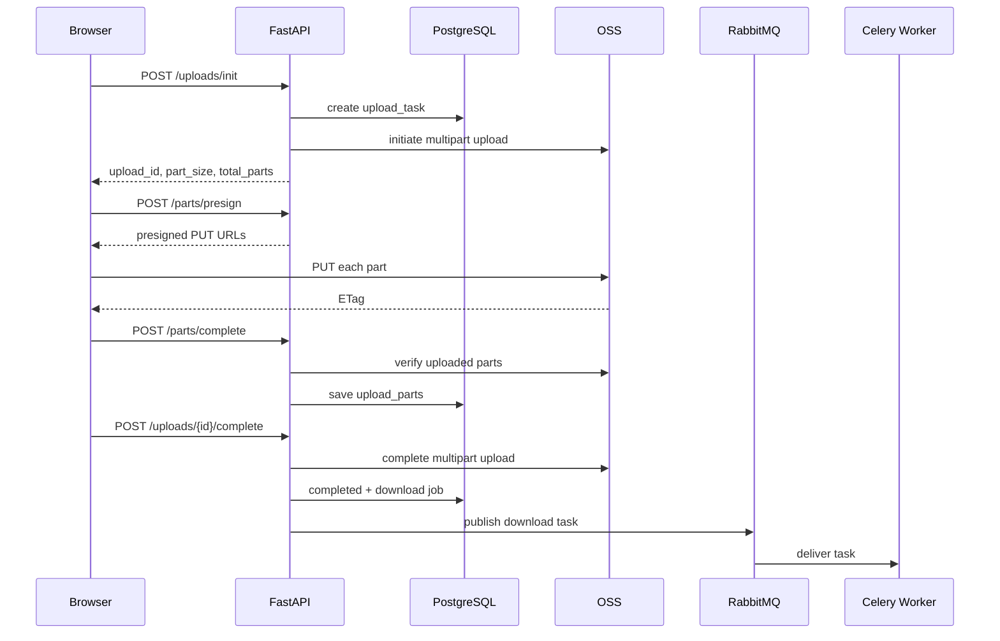

# 03 OSS、RabbitMQ、Celery 与大文件流水线

## 一、为什么浏览器直传 OSS

传统上传：

```text
Browser -> FastAPI -> Local Disk / OSS
```

大文件会占用 API 网络带宽、连接时间和磁盘空间。当前方案：

```text
Browser -> FastAPI 申请上传任务和签名
Browser -> OSS 直接 PUT 分片
Browser -> FastAPI 提交 ETag 并完成上传
```

FastAPI 仍然控制身份、object key、大小、类型、part number、有效期和最终状态，但不转发文件主体。

## 二、Multipart Upload 全链路



对象路径由后端生成：

```text
{prefix}/{organization_id}/{knowledge_base_id}/{upload_id}/source.{extension}
```

原始文件名只用于展示，不能直接拼路径，可防止路径穿越、重名覆盖和租户边界混乱。

## 三、断点续传到底怎么实现

断点续传不是浏览器自动把一个失败的 HTTP 请求接着发完，而是把一个大文件拆成多个可以独立重试的 part，并把上传进度持久化。

一次上传至少需要保存两类标识：

```text
upload_id              应用侧上传任务 ID
multipart_upload_id    OSS Multipart Upload ID
object_key             OSS 对象路径
part_size              每个分片大小
total_parts            分片总数
```

完整流程：

```text
1. init 创建 UploadTask 和 OSS Multipart Upload
2. 客户端按 part_size 计算 part_number
3. 只为待上传 part 申请 presigned URL
4. PUT part 到 OSS，保存返回的 ETag
5. 网络中断或页面刷新
6. 用 upload_id 查询 UploadTask 和已上传 parts
7. 计算缺失的 part_number
8. 只重新上传缺失 part
9. 收集完整 part_number + ETag 列表
10. complete，由 OSS 合并所有 parts
```

假设一个文件被切成 4 片，已经成功上传 1、2、4：

```text
数据库或 OSS 状态：{1, 2, 4}
缺失分片：         {3}
恢复时只 PUT part 3
最后 complete 提交：1、2、3、4 的 ETag
```

因此，断点续传的关键不是“重新上传整个文件”，而是：

> 用持久化的 upload_id 找回 OSS Multipart Upload，再根据已完成 part 列表补传缺失部分。

当前项目已经提供状态和分片查询接口：

```text
GET /uploads/{upload_id}
GET /uploads/{upload_id}/parts
```

并提供批量签名接口，客户端可以只为缺失 part 申请 URL：

```text
POST /uploads/{upload_id}/parts/presign
POST /uploads/{upload_id}/parts/presign/batch
```

需要注意一个容易被问到的边界：如果浏览器彻底丢失了 `upload_id`，服务端无法凭文件名可靠判断哪一个 Multipart Upload 属于当前文件。产品通常会在浏览器的 IndexedDB/localStorage 保存上传任务映射，或者使用“文件大小 + 最后修改时间 + SHA256”的 fingerprint 让服务端查找可恢复任务。当前项目以后可以在前端补充这层自动恢复体验。

## 四、UploadTask 和 UploadPart 为什么要分表

`UploadTask` 表示整个文件，`UploadPart` 表示一个分片。两者不是重复设计：

```text
UploadTask
  文件名、文件大小、object_key、总分片数、整体状态、创建人

UploadPart
  part_number、size、ETag、上传状态、失败次数、更新时间
```

例如：

```text
upload_task: upl_xxx, total_parts=4, status=uploading
upload_parts: (1, completed, etag-a)
              (2, completed, etag-b)
              (4, completed, etag-d)
```

这样可以回答“已经上传到第几片”“哪些片失败”“恢复时还缺哪些片”，也可以支持多端恢复和审计。

数据库记录是应用侧的进度快照，但 complete 前仍应向 OSS 查询并校验真实 part 列表。因为可能出现“OSS 已经成功，数据库写入失败”，或者客户端拿着旧 ETag 重试的情况。

## 五、上传状态机和接口幂等

上传任务不是只有成功和失败两个状态，典型状态可以理解为：

```text
initiated -> uploading -> completing -> completed
     |          |             |
     v          v             v
  cancelled   failed        failed
     ^
   expired
```

状态约束很重要：

- `completed`、`cancelled`、`expired` 后不能继续签发 part URL；
- `complete` 只能处理处于上传中的任务；
- 同一个 `part_number` 重传时，可以用新的 ETag 覆盖旧进度；
- 重复调用 complete 时，应返回已有完成结果或明确冲突，不能重复创建 document 和 processing job；
- abort 后要同时更新数据库状态并调用 OSS abort multipart upload。

面试中可以这样回答“如何保证幂等”：

```text
上传任务用 upload_id 做业务主键；
分片用 (upload_task_id, part_number) 做唯一约束；
complete 前检查任务状态和完整 part 集合；
后续 document/job 用 upload_task_id 做唯一关联或重复检查。
```

## 六、分片失败重试和并发控制

分片上传适合单片重试，不应该因为第 3 片失败就重传整个文件：

```text
part 3 PUT 失败
  -> 等待 1s
  -> 重试
  -> 再失败等待 2s、4s
  -> 超过最大次数，标记 part failed
  -> 整体任务暂停或失败，等待用户继续
```

指数退避通常还要加随机抖动，避免大量客户端同时重试造成流量尖峰。

并发也要分层理解：

```text
浏览器并发上传 4 个 part
    -> 每个 part 都是独立 PUT
    -> 服务端 API 只负责签名和状态
    -> OSS 承担文件接收
```

需要控制的不是一个数字，而是多个配额：

- 单个文件大小和最大 part 数；
- 单个用户或组织的同时上传任务数；
- 同时上传的总字节数；
- 浏览器单任务并发 part 数；
- 后续 download、parse、embedding 的独立并发池。

浏览器内的 semaphore 只能限制一个页面或一个标签页，不能限制多个浏览器、多台 API 实例。全局配额需要 PostgreSQL 条件更新、Redis 计数器或专门的限流服务。

## 七、完整性校验：ETag 不等于文件 SHA256

这是大文件上传的高频面试题：

- `ETag` 是 OSS 对某个 part 的返回标识，用于 complete 时确认分片；
- Multipart Upload 场景下，最终 ETag 通常不能直接当作整个文件的 MD5；
- SHA256 才适合做完整文件的强校验、去重线索和审计标识。

建议采用分层校验：

```text
上传阶段：检查 part_number、ETag、声明大小和任务状态
complete 阶段：向 OSS 查询真实 part 列表并合并
后处理阶段：流式下载对象，计算 SHA256 和实际大小
解析阶段：magic number、内部结构和对应 parser 再校验
```

SHA256 必须流式计算：

```python
hasher = hashlib.sha256()
while data := stream.read(1024 * 1024):
    hasher.update(data)
actual_sha256 = hasher.hexdigest()
```

这样不会因为一个几 GB 的文件被一次性读入内存而导致进程 OOM。

## 八、预签名 URL 的安全边界

预签名 URL 是“有时效、有限权限的临时通行证”，不是永久公开地址。生成前后端至少要校验：

```text
当前用户是否属于 upload_task 所属组织
upload_task 是否仍处于 uploading
part_number 是否在 1..total_parts
HTTP method 是否固定为 PUT
Content-Type / Content-Length 是否与签名一致
object_key 是否由后端生成且属于当前任务 prefix
过期时间是否不超过配置上限
```

浏览器不需要 AccessKey Secret。后端使用密钥生成短期 URL，浏览器只拿 URL 上传。OSS Bucket 还必须配置允许前端 Origin 的 CORS，否则浏览器会在预检阶段拦截 PUT，即使签名本身正确。

如果 URL 泄露，风险窗口就是它的有效期和签名允许的操作范围，所以不要把完整 presigned URL 写入日志、数据库响应历史或错误监控。

## 九、取消、过期任务和孤儿分片

用户关闭页面、网络长期失败或任务无人继续时，OSS 里可能留下未完成 Multipart Upload。它们会占用存储，不能只依赖业务数据库状态。

企业实现通常包含：

```text
用户取消 -> POST /uploads/{id}/abort -> OSS abort + DB cancelled
长时间无心跳 -> 标记 expired -> OSS abort
定时清理任务 -> 扫描过期 UploadTask 和 OSS 未完成 multipart
对账任务 -> 发现 OSS 有、数据库没有的孤儿上传并告警/清理
```

OSS 生命周期规则可以作为最后一道兜底，但不能替代业务状态管理。清理任务必须避免误删正在上传的任务，因此要结合 `updated_at`、租约或最后心跳判断。

## 十、为什么不用 FastAPI 中转整个大文件

| 方案                      | 优点                         | 主要问题                                 |
| ------------------------- | ---------------------------- | ---------------------------------------- |
| Browser -> FastAPI -> OSS | 逻辑直观                     | API 带宽、连接、磁盘和扩容成本都变成瓶颈 |
| Browser -> OSS 直传       | API 只签名，OSS 承担吞吐     | 需要处理 CORS、签名、状态恢复和安全校验  |
| 单请求上传                | 实现简单                     | 失败后通常只能从头重传，不适合大文件     |
| Multipart Upload          | 分片重试、断点恢复、并发上传 | 状态机、清理和幂等更复杂                 |

当前项目选择“浏览器直传阿里云 OSS Multipart Upload”，因为原文件接收和后续解析索引是两个不同问题：上传先保证可靠落盘，解析、切片、Embedding 和 ES 入库再交给异步流水线。

## 十一、ETag 和两次真实故障

ETag 是 OSS 对上传 part 返回的标识。客户端 complete part 时提交，后端和 OSS part 列表比对。

项目调试中出现过两类典型错误：

1. `SignatureDoesNotMatch`：预签名时 `Content-Type` 进入签名，但 PUT 请求头不一致；修复原则是签名参数和实际请求必须完全一致。
2. `etag does not match`：客户端 ETag 引号、大小写或格式与服务端记录不一致；需要统一规范化后再比较，但不能跳过 OSS 校验。

## 十二、为什么 RabbitMQ 和 PostgreSQL job 都要有

- RabbitMQ 负责“把任务交给消费者”，擅长路由、ACK、重投和削峰；
- PostgreSQL job 负责“业务状态是什么”，可查询 stage、attempt、错误、依赖和 document ID。

MQ 消息不是长期业务主事实。如果消息重复或 Worker 重启，数据库状态用于幂等判断和恢复。

## 十三、阶段级流水线

```text
download -> validate -> parse -> split -> embed -> index
```

同一个文件必须按顺序，不同文件可以位于不同阶段：

```text
文件 A: index
文件 B: embed
文件 C: parse
文件 D: download
```

这提升的是多文件总吞吐，而不是让单个文件跳过依赖并行执行。

当前 Celery 将普通任务和 Embedding 分到不同队列：普通 Worker 可以保持较高并发，Embedding Worker 并发为 1，避免多个进程各加载一份 BGE-M3 导致内存竞争。

## 十四、进程、线程和 Celery prefork

- 线程共享进程内存，适合大量 I/O 等待，但受 Python GIL 影响，CPU 密集 Python 代码不能有效并行；
- 进程内存隔离，可利用多个 CPU 核，但模型会被每个进程各加载一份；
- Celery 默认 `prefork` 是主 Worker 预先 fork 多个子进程，子进程并行消费任务。

`BoundedSemaphore` 只限制单个 Python 进程内的并发，不是多 Worker、多容器的全局限流。Celery 场景更适合用独立队列、Worker concurrency、数据库 lease 或外部限流器。

## 十五、可靠性关键点

### 幂等

任务可能因为 ACK 丢失、超时或重试被执行多次。每个阶段执行前检查数据库状态，写入要使用稳定业务键或唯一约束，避免重复 document、chunk 和 ES 文档。

### ACK 与 prefetch

- ACK 表示 Worker 确认消息已处理；
- late ACK 可以在任务成功后确认，Worker 中途崩溃时消息可重投；
- prefetch 控制 Worker 提前拿多少消息，耗时任务通常不宜过大，避免某个 Worker 囤积任务。

### 重试和死信

短暂网络错误可指数退避重试；超过最大次数进入失败状态或 DLQ。不要同时让 Celery、数据库 job 和 RabbitMQ 死信各自无限重试，否则会形成难以解释的三套重试。

### 任务领取

严格多消费者 claim 可以使用：

```sql
SELECT ... FOR UPDATE SKIP LOCKED
```

一个事务锁定可领取行，其他消费者跳过已锁行。也可以通过条件 `UPDATE ... WHERE status='pending'` 检查受影响行数实现乐观 claim。

## 十六、文件安全

后缀和前端 MIME 都不可信。后处理阶段还要做：

- magic number 文件头检测；
- PDF/Office 内部结构可解析性；
- ZIP bomb 的压缩比、条目数和展开大小限制；
- 文件大小和 hash 二次校验；
- parser 超时、内存和异常隔离；
- 可选恶意文件扫描。

SHA256 用于完整性、去重线索和审计。大文件必须流式读取计算，不能一次性载入内存。

## 十七、大文件上传常见面试追问

### 如何设计断点续传？

文件先初始化 Multipart Upload，服务端保存 `upload_id`、OSS `multipart_upload_id`、`part_size` 和 `total_parts`。客户端恢复时查询已完成 part，只补传缺失 part，最后提交完整的 `part_number + ETag` 列表完成合并。

### 用户刷新页面后还能继续吗？

前提是客户端仍然保存 `upload_id`，或者服务端能通过文件 fingerprint 找到未完成任务。仅凭原始文件名不可靠，因为同名文件可能内容不同。

### 如何避免重复上传？

可以在上传前计算文件大小、修改时间和 SHA256 fingerprint，查询同组织下是否已有相同文件。这个判断只能作为优化，最终仍要考虑文件更新、权限和版本策略，不能简单用文件名去重。

### 分片上传成功但数据库没记录怎么办？

complete 前以 OSS 的 `list parts` 为准，数据库记录可以补偿。反过来如果数据库有记录但 OSS 没有，需要清理或重新签发该 part，不能盲目相信数据库。

### complete 被调用两次怎么办？

通过状态机和幂等键处理：第一次成功后任务为 `completed`，第二次直接返回已有结果；如果两次请求同时到达，用条件更新或数据库锁保证只有一个请求执行合并和创建后续 job。

### 为什么不把所有上传分片先落本地磁盘？

这会使每个 API 副本都承担磁盘容量和清理压力。直传 OSS 后，后端只在后处理阶段按流读取对象，API 更容易横向扩容。

### 大文件上传和后续解析为什么要拆开？

上传主要消耗网络和对象存储 I/O；PDF/DOCX/XLSX 解析消耗 CPU 和内存；Embedding 还可能消耗模型内存或外部 API 配额。拆开后可以分别限流、重试、监控和扩容。

### 如何处理上传任务过期？

数据库定时扫描长时间未更新的任务，先确认没有活跃心跳，再调用 OSS abort，最后更新为 `expired`。同时用 OSS 生命周期规则清理遗漏的未完成 Multipart Upload。

### presigned URL 会不会越权？

后端在签发前校验当前用户、组织、任务状态、part 范围和 object prefix；URL 只允许固定 HTTP method 和短期有效。即使前端隐藏按钮，也不能代替后端校验。

### 为什么要同时校验 MIME、magic number 和 parser？

MIME 和后缀容易伪造，magic number 能判断文件头，内部结构能判断 ZIP/Office/PDF 是否像对应格式，parser 能进一步验证是否可安全处理。三者解决的是不同层次的问题。

## 十八、常见追问

### 为什么用 RabbitMQ，不直接后台线程？

后台线程跟随 API 进程生命周期，重启会丢任务，多实例之间无法共享队列，也缺少成熟 ACK、路由和重试。RabbitMQ 让 API 和 Worker 独立扩容。

### RabbitMQ 和 Redis 有什么区别？

Redis 是内存数据结构服务器，也能做简单队列；RabbitMQ 是消息 Broker，提供 exchange、routing key、ACK、prefetch、DLX 等更完整消息语义。本项目 Redis 主要做 JWT 撤销，RabbitMQ 做任务消息。

### complete 成功但消息没发出去怎么办？

这是数据库与 MQ 双写一致性问题。当前可通过数据库 pending job 的补偿扫描恢复；更严格方案是 Transactional Outbox：业务事务内写 outbox，再由发布器可靠投递并标记发送。

## 十九、关键代码

- [上传 API](../../backend/app/api/upload.py)
- [上传任务与签名规则](../../backend/app/services/upload_service.py)
- [OSS adapter](../../backend/app/services/storage/aliyun_oss.py)
- [阶段任务服务](../../backend/app/services/upload_postprocess_service.py)
- [Celery tasks](../../backend/app/tasks/upload_tasks.py)
- [Celery 配置](../../backend/app/celery_app.py)
- [上传学习资料](../large-file-upload/README.md)
- [MQ 学习资料](../message-queue/README.md)
