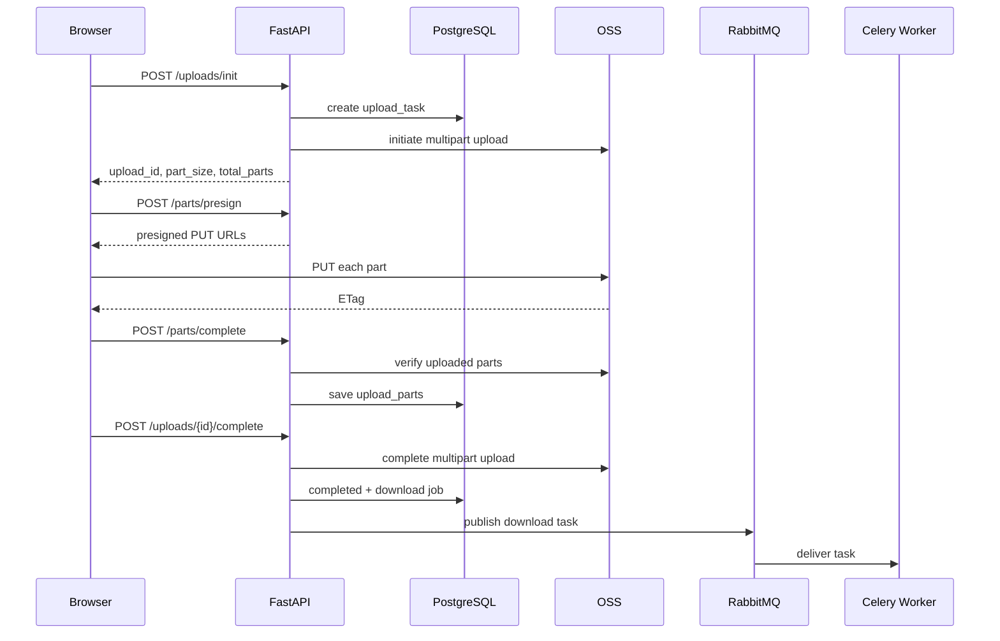

# 03 OSS、RabbitMQ、Celery 与大文件流水线

## 一、为什么浏览器直传 OSS

传统上传：

```text
Browser -> FastAPI -> Local Disk / OSS
```

大文件会占用 API 网络带宽、连接时间和磁盘空间。当前方案：

```text
Browser -> FastAPI 申请上传任务和签名
Browser -> OSS 直接 PUT 分片
Browser -> FastAPI 提交 ETag 并完成上传
```

FastAPI 仍然控制身份、object key、大小、类型、part number、有效期和最终状态，但不转发文件主体。

## 二、Multipart Upload 全链路



对象路径由后端生成：

```text
{prefix}/{organization_id}/{knowledge_base_id}/{upload_id}/source.{extension}
```

原始文件名只用于展示，不能直接拼路径，可防止路径穿越、重名覆盖和租户边界混乱。

## 三、ETag 和两次真实故障

ETag 是 OSS 对上传 part 返回的标识。客户端 complete part 时提交，后端和 OSS part 列表比对。

项目调试中出现过两类典型错误：

1. `SignatureDoesNotMatch`：预签名时 `Content-Type` 进入签名，但 PUT 请求头不一致；修复原则是签名参数和实际请求必须完全一致。
2. `etag does not match`：客户端 ETag 引号、大小写或格式与服务端记录不一致；需要统一规范化后再比较，但不能跳过 OSS 校验。

## 四、为什么 RabbitMQ 和 PostgreSQL job 都要有

- RabbitMQ 负责“把任务交给消费者”，擅长路由、ACK、重投和削峰；
- PostgreSQL job 负责“业务状态是什么”，可查询 stage、attempt、错误、依赖和 document ID。

MQ 消息不是长期业务主事实。如果消息重复或 Worker 重启，数据库状态用于幂等判断和恢复。

## 五、阶段级流水线

```text
download -> validate -> parse -> split -> embed -> index
```

同一个文件必须按顺序，不同文件可以位于不同阶段：

```text
文件 A: index
文件 B: embed
文件 C: parse
文件 D: download
```

这提升的是多文件总吞吐，而不是让单个文件跳过依赖并行执行。

当前 Celery 将普通任务和 Embedding 分到不同队列：普通 Worker 可以保持较高并发，Embedding Worker 并发为 1，避免多个进程各加载一份 BGE-M3 导致内存竞争。

## 六、进程、线程和 Celery prefork

- 线程共享进程内存，适合大量 I/O 等待，但受 Python GIL 影响，CPU 密集 Python 代码不能有效并行；
- 进程内存隔离，可利用多个 CPU 核，但模型会被每个进程各加载一份；
- Celery 默认 `prefork` 是主 Worker 预先 fork 多个子进程，子进程并行消费任务。

`BoundedSemaphore` 只限制单个 Python 进程内的并发，不是多 Worker、多容器的全局限流。Celery 场景更适合用独立队列、Worker concurrency、数据库 lease 或外部限流器。

## 七、可靠性关键点

### 幂等

任务可能因为 ACK 丢失、超时或重试被执行多次。每个阶段执行前检查数据库状态，写入要使用稳定业务键或唯一约束，避免重复 document、chunk 和 ES 文档。

### ACK 与 prefetch

- ACK 表示 Worker 确认消息已处理；
- late ACK 可以在任务成功后确认，Worker 中途崩溃时消息可重投；
- prefetch 控制 Worker 提前拿多少消息，耗时任务通常不宜过大，避免某个 Worker 囤积任务。

### 重试和死信

短暂网络错误可指数退避重试；超过最大次数进入失败状态或 DLQ。不要同时让 Celery、数据库 job 和 RabbitMQ 死信各自无限重试，否则会形成难以解释的三套重试。

### 任务领取

严格多消费者 claim 可以使用：

```sql
SELECT ... FOR UPDATE SKIP LOCKED
```

一个事务锁定可领取行，其他消费者跳过已锁行。也可以通过条件 `UPDATE ... WHERE status='pending'` 检查受影响行数实现乐观 claim。

## 八、文件安全

后缀和前端 MIME 都不可信。后处理阶段还要做：

- magic number 文件头检测；
- PDF/Office 内部结构可解析性；
- ZIP bomb 的压缩比、条目数和展开大小限制；
- 文件大小和 hash 二次校验；
- parser 超时、内存和异常隔离；
- 可选恶意文件扫描。

SHA256 用于完整性、去重线索和审计。大文件必须流式读取计算，不能一次性载入内存。

## 九、常见追问

### 为什么用 RabbitMQ，不直接后台线程？

后台线程跟随 API 进程生命周期，重启会丢任务，多实例之间无法共享队列，也缺少成熟 ACK、路由和重试。RabbitMQ 让 API 和 Worker 独立扩容。

### RabbitMQ 和 Redis 有什么区别？

Redis 是内存数据结构服务器，也能做简单队列；RabbitMQ 是消息 Broker，提供 exchange、routing key、ACK、prefetch、DLX 等更完整消息语义。本项目 Redis 主要做 JWT 撤销，RabbitMQ 做任务消息。

### complete 成功但消息没发出去怎么办？

这是数据库与 MQ 双写一致性问题。当前可通过数据库 pending job 的补偿扫描恢复；更严格方案是 Transactional Outbox：业务事务内写 outbox，再由发布器可靠投递并标记发送。

## 十、关键代码

- [上传 API](../../backend/app/api/upload.py)
- [上传任务与签名规则](../../backend/app/services/upload_service.py)
- [OSS adapter](../../backend/app/services/storage/aliyun_oss.py)
- [阶段任务服务](../../backend/app/services/upload_postprocess_service.py)
- [Celery tasks](../../backend/app/tasks/upload_tasks.py)
- [Celery 配置](../../backend/app/celery_app.py)
- [上传学习资料](../large-file-upload/README.md)
- [MQ 学习资料](../message-queue/README.md)
