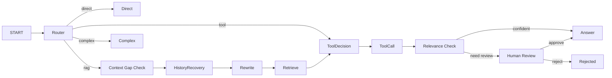

# 06 RAG、LangGraph、Checkpoint、人工审核与 SSE

## 一、RAG 的基本链路

```text
Question
  -> Retrieve relevant chunks
  -> Format context with source numbers
  -> LLM generates grounded answer
  -> Return citations
```

RAG 的目标不是让模型“知道更多”，而是在回答时提供当前、可追溯、受权限控制的外部证据。模型仍可能错误理解证据，因此需要 relevance gate、引用约束和人工审核。

## 二、LangGraph 为什么适合这里

普通链式调用适合固定流程；当前系统存在多路线、条件分支、中断和恢复：



LangGraph 把这些步骤显式建模为 node、edge 和 state，便于观察 `node_trace`、插入 checkpoint 和从 interrupt 恢复。

## 三、Router 怎么判断路线

Qwen Router 根据系统提示和结构化输出选择：

- `direct`：寒暄、通用解释，不需要企业知识；
- `rag`：需要少量知识库证据的具体问题；
- `complex`：需要跨文档总结、对比和规划；
- `tool`：用户明确要求展开上一轮文档、查看邻居 chunk 或列出资料。

规则兜底用于模型未配置、超时或输出非法时。Router 不需要知道全部文档内容，只判断问题是否依赖当前知识库；知识库选择是另一个问题，当前 API 通常已经带 `knowledge_base_id`。

## 四、GraphState 是什么

State 是节点之间传递的结构化工作区，不等于把所有内容放进一个 prompt。典型字段：

```text
question / route / route_reason
query_variants
retrieved_docs / context / context_pack
tool_call / tool_results
relevance_decision / need_human_review
answer / citations
thread_id / conversation_id / node_trace
```

Router、Rewrite、Answer 可以使用不同系统提示和输入字段。上下文隔离由应用代码决定，LangGraph 提供状态传递和编排机制，不会自动替你隔离 prompt。

## 五、Checkpoint 与消息记录

### Message

用户产品层历史：谁说了什么，用于会话列表和历史回显。

### Checkpoint

工作流执行快照：节点执行到哪、state 是什么、是否 interrupt、下一步是什么。

```text
human_review interrupt
  -> PostgresSaver 写 checkpoint
  -> API/Worker 重启
  -> 用同一 thread_id get_state
  -> Command(resume={approved: true})
  -> 从暂停位置继续
```

使用 PostgreSQL 而不是 `InMemorySaver`，是为了跨图实例、跨 Uvicorn Worker 和进程重启恢复。状态边界指“状态超出这个范围就不可见”：内存状态边界是进程，PostgreSQL 状态边界则扩展到所有能访问该库的实例。

## 六、PostgresSaver 与 Psycopg

- PostgreSQL：数据库服务；
- Psycopg：Python 与 PostgreSQL 通信的 driver；
- `PostgresSaver`：LangGraph 基于 Psycopg 把 checkpoint 写入 PostgreSQL 的实现。

连接池维护可复用连接，请求借用后归还，避免每次聊天重新建立 TCP、认证和 TLS 连接。

`setup` 只通过显式脚本初始化第三方 checkpoint 表；应用每次启动只连接，不自动 DDL，防止多副本同时改表。

## 七、Human-in-the-loop

当候选为空、rerank 分数低或证据不足时：

```text
relevance_check
  -> need_human_review=True
  -> interrupt(review_payload)
  -> 前端显示审核面板
  -> approve/reject
  -> POST resume
  -> Command(resume=...)
```

`snapshot.values` 是保存的 GraphState；`snapshot.interrupts` 表示当前存在未恢复的中断。审核任务还会写业务表，便于页面展示和审计。

并发点击 resume 的严格处理可继续用条件更新或行锁加强，保证只有第一个操作把 review task 从 pending 改为 completed。

## 八、SSE 为什么使用事件协议

SSE 是服务端到浏览器的单向流，格式以空行分隔事件：

```text
event: node
data: {"name":"retrieve"}

event: answer
data: 回答增量

event: references
data: [{"chunk_id":51}]
```

前端必须维护 buffer，因为一次网络 `read()` 可能拿到半个事件或多个事件。只有遇到完整 `\n\n` 才解析。

当前答案链路为了稳定获得结构化引用，模型可先完成结构化 JSON，再由后端按 SSE 分段发送 answer。它提供“渐进展示”，但不是模型 token 到达即转发的真 token streaming。真正 token 流需要把回答文本与引用协议解耦，并处理 JSON 转义和不完整结构。

## 九、常见追问

### LangGraph 和普通状态机有什么区别？

本质上仍是状态图。LangGraph 提供面向 LLM 工作流的 state merge、checkpoint、interrupt、Command resume 和节点编排，减少自行实现恢复协议的成本。

### 为什么检索为空就人工审核？

不是所有系统都必须人工审核。这里用于企业演示：证据不足时不让模型编答案。生产上可按业务风险选择直接 no-answer、转人工或触发补充检索。

### SSE 和 WebSocket 怎么选？

SSE 适合服务端持续推送、协议简单、浏览器原生支持；WebSocket 是双向长连接，适合实时协作和高频双向消息。当前问答主要是请求后服务端流式返回，SSE 足够。

## 十、关键代码

- [图结构](../../backend/app/graph/langgraph_workflow.py)
- [GraphState](../../backend/app/graph/state.py)
- [节点实现](../../backend/app/graph/nodes.py)
- [Checkpoint 生命周期](../../backend/app/graph/checkpointer.py)
- [Chat API 与 SSE](../../backend/app/api/chat.py)
- [Router LLM](../../backend/app/services/llm_router_service.py)
- [Answer LLM](../../backend/app/services/llm_answer_service.py)

