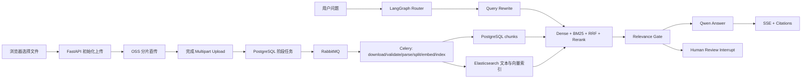

# AI Knowledge Hub 面试准备导航

这套资料不是脱离项目背八股，而是围绕当前仓库的真实实现回答四个问题：

1. 系统解决了什么业务问题？
2. 一次请求或任务在系统中怎样流转？
3. 为什么选择这些技术，做过哪些取舍？
4. 面试官继续追问时，能否落到代码、数据和故障场景？

## 一、项目定位

AI Knowledge Hub 是一个面向企业内部资料的知识库与专家 Agent 系统。它支持多格式文档上传、结构化切分、混合检索、RAG 问答、人工审核、组织级权限和异步处理。

当前技术栈：

```text
React + Vite + TypeScript + Mantine
                |
             FastAPI
                |
    PostgreSQL / Redis / Elasticsearch
                |
       RabbitMQ + Celery Worker
                |
         Aliyun OSS / Qwen
```

## 二、30 秒项目介绍

> 我做了一个企业知识库与专家 Agent 系统。用户可以上传 PDF、DOCX、XLSX、Markdown、TXT 等文件，文件通过 OSS 分片直传，RabbitMQ 和 Celery 按 download、validate、parse、split、embed、index 阶段异步处理。检索采用 BGE-M3 Dense、Elasticsearch BM25、RRF 融合和 BGE reranker，回答工作流用 LangGraph 编排，并通过 PostgreSQL checkpoint 支持人工审核后跨进程恢复。系统还实现了组织级 RBAC、Elasticsearch 权限过滤、JWT 撤销、审计日志、可观测性和 Docker Compose 一键环境。

## 三、2 分钟项目介绍

按以下顺序讲，避免一开始堆技术名词：

1. **业务问题**：企业文档格式杂、信息分散，普通关键词搜索难以理解语义，纯向量搜索又容易漏掉制度编号和精确术语。
2. **数据入口**：浏览器不把大文件经过 FastAPI 中转，而是向后端申请 OSS multipart presigned URL，再直传 OSS。
3. **异步处理**：上传完成只创建数据库任务并投递 Celery，各阶段按依赖串行，不同文件之间形成流水线并发。
4. **文档理解**：不同 parser 先生成统一 `DocumentElement`，再构建 `Section`、`Block` 和 `ChunkData`，尽量保留标题、列表、表格、代码块和页码。
5. **检索**：Dense 处理语义改写，BM25 处理精确词，RRF 融合不可直接比较的两类分数，reranker 再对 query 与候选 chunk 做精排。
6. **Agent**：Router 区分 direct、rag、complex、tool；RAG 路线支持 query rewrite、证据门禁、只读工具和 human-in-the-loop。
7. **企业边界**：所有资源带 `organization_id`，PostgreSQL 查询和 Elasticsearch 召回都先过滤权限；OSS key 由后端生成。
8. **工程能力**：Alembic 管理 schema，PostgreSQL 持久化 checkpoint，Redis 撤销 JWT，Docker Compose 和 CI 提供可重复交付，JSON 日志、request ID、metrics 和 readiness 用于定位问题。

## 四、系统主链路



## 五、专题目录

| 文件                                                                                              | 重点                                                |
| ------------------------------------------------------------------------------------------------- | --------------------------------------------------- |
| [01-system-architecture-and-project-story.md](01-system-architecture-and-project-story.md)         | 架构、业务链路、项目取舍、简历讲法                  |
| [02-fastapi-postgresql-alembic-rbac.md](02-fastapi-postgresql-alembic-rbac.md)                     | FastAPI、SQLModel、PostgreSQL、Alembic、JWT、RBAC   |
| [03-oss-rabbitmq-celery-upload-pipeline.md](03-oss-rabbitmq-celery-upload-pipeline.md)             | OSS 分片上传、MQ、Celery、阶段任务、幂等和重试      |
| [04-multiformat-parsing-and-chunking.md](04-multiformat-parsing-and-chunking.md)                   | 多格式解析、Section/Block/Chunk、语义 overlap       |
| [05-elasticsearch-hybrid-retrieval-and-rerank.md](05-elasticsearch-hybrid-retrieval-and-rerank.md) | Dense、BM25、倒排索引、RRF、rerank、评估            |
| [06-rag-langgraph-checkpoint-hitl-sse.md](06-rag-langgraph-checkpoint-hitl-sse.md)                 | RAG、LangGraph、checkpoint、人工审核、SSE           |
| [07-query-rewrite-context-memory-and-tools.md](07-query-rewrite-context-memory-and-tools.md)       | Query Rewrite、上下文预算、摘要、记忆、Tool Calling |
| [08-frontend-docker-ci-observability-security.md](08-frontend-docker-ci-observability-security.md) | React、Docker、CI、日志、metrics、安全边界          |
| [09-high-frequency-interview-questions.md](09-high-frequency-interview-questions.md)               | 高频问题与参考回答                                  |
| [10-key-code-walkthrough.md](10-key-code-walkthrough.md)                                           | 面试前必须能讲清的关键代码入口                      |

## 六、推荐复习顺序

时间只剩 3 天时：

```text
README -> 01 -> 03 -> 05 -> 06 -> 09 -> 10
```

时间有 1 周时：

```text
Day 1: 01、02
Day 2: 03
Day 3: 04、05
Day 4: 06、07
Day 5: 08
Day 6: 09，口述回答并录音
Day 7: 10，顺着真实代码再走一遍
```

## 七、回答原则

- 区分“已经实现”“已验证”“后续可升级”，不要把设计计划说成现状。
- 先说问题和方案，再说框架名称。
- 主动讲 trade-off，例如 PostgreSQL checkpoint 提高可靠性，但增加连接和表管理成本。
- 不背具体阈值。阈值来自评估集，应说明如何测出来，而不是声称是行业固定值。
- 遇到不会的细节，可以说明当前边界和下一步验证方式，不要编造生产数据。
